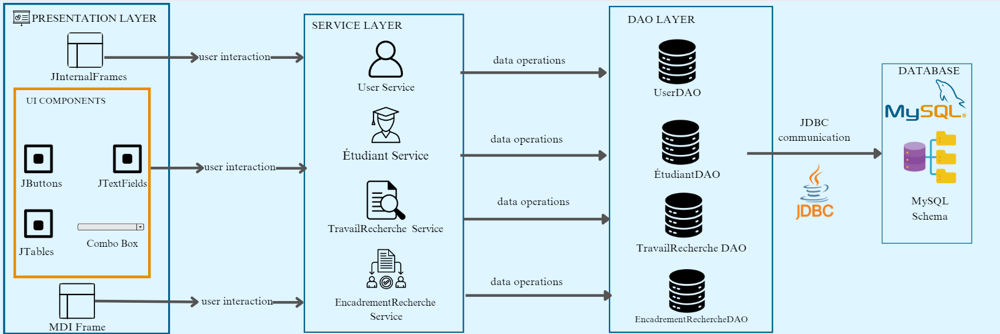

# Suivi des Travaux de Recherche des Étudiants

## Description

Le Suivi des Travaux de Recherche des Étudiants est une application Java Swing conçue pour simplifier la gestion et le suivi des travaux de recherche réalisés par les étudiants sous la supervision d'un professeur. Elle offre une plateforme centralisée pour organiser les informations, suivre l'avancement et faciliter la communication.


## Contexte

Dans le cadre de la gestion des activités de recherche au sein d'une institution académique, il est essentiel de disposer d'un outil efficace pour le suivi des travaux de recherche des étudiants. Cet outil permettra de centraliser les informations relatives aux projets, aux étudiants et aux professeurs encadrants, facilitant ainsi la supervision et l'évaluation des travaux.

## Problématique

Actuellement, le suivi des travaux de recherche est réalisé de manière fragmentée, utilisant des méthodes manuelles ou des outils disparates. Cela entraîne des difficultés dans la gestion des informations, la communication entre les acteurs et la production de rapports précis.

## Objectifs

* **Centraliser les informations :** Regrouper toutes les données relatives aux travaux de recherche, aux étudiants et aux professeurs encadrants dans une base de données unique.
* **Faciliter la gestion :** Offrir une interface conviviale pour la création, la modification et la suppression des travaux de recherche.
* **Améliorer le suivi :** Permettre aux professeurs encadrants de suivre l'avancement des travaux de leurs étudiants.
* **Optimiser la recherche :** Permettre une recherche efficace des travaux par titre et un filtrage par professeur.

## Diagramme use case 


## Diagramme de classe


## Architecture
 

## Technologies

* **Langage :** Java
* **Framework d'interface graphique :** Java Swing
* **Base de données :** MySQL
* **Bibliothèque graphique :** JFreeChart
* **Outils de développement :**
    * IDE Java : NetBeans
    * Outil de diagramme : MagicDraw
    * Outil de gestion de base de données : phpMyAdmin
* **Accès aux données :** JDBC

##   Vidéo sur les interfaces de l'application

[Lien vers mon fichier Google Drive](https://drive.google.com/drive/folders/1A7fjDE2WgJrZpOAp1LGVkc6wyDWEZq3T)

## Structure de la Base de Données

Le système repose sur quatre tables principales :

1.  **TravailRecherche** : Informations sur les travaux de recherche (id, titre, description, dates de début et de fin).
2.  **Étudiant** : Informations sur les étudiants (id, nom, prénom, email).
3.  **EncadrementRecherche** : Lien entre les travaux, les étudiants et les professeurs (travail_id, etudiant_id, professeur).
4.  **Utilisateur** : Informations d'authentification (login, mot de passe).

### Schéma de la Base de Données

```sql
CREATE TABLE etudiant (
    id INT(11) AUTO_INCREMENT PRIMARY KEY,
    nom VARCHAR(100) NOT NULL,
    prenom VARCHAR(255) NULL,
    email VARCHAR(255) NOT NULL UNIQUE
);

CREATE TABLE travailrecherche (
    id INT(11) AUTO_INCREMENT PRIMARY KEY,
    titre VARCHAR(255) NOT NULL,
    description TEXT NULL,
    dateDebut DATE NULL,
    dateFin DATE NULL
);

CREATE TABLE encadrementrecherche (
    travail_id INT(11) NOT NULL,
    etudiant_id INT(11) NOT NULL,
    professeur VARCHAR(255) NULL,
    PRIMARY KEY (travail_id, etudiant_id),
    FOREIGN KEY (travail_id) REFERENCES travailrecherche(id) ON DELETE CASCADE ON UPDATE CASCADE,
    FOREIGN KEY (etudiant_id) REFERENCES etudiant(id) ON DELETE CASCADE ON UPDATE CASCADE
);

CREATE TABLE user (
    login VARCHAR(255) PRIMARY KEY,
    password VARCHAR(255) NOT NULL,
    securityQuestion VARCHAR(255),
    securityAnswer VARCHAR(255),
    email VARCHAR(255)
);